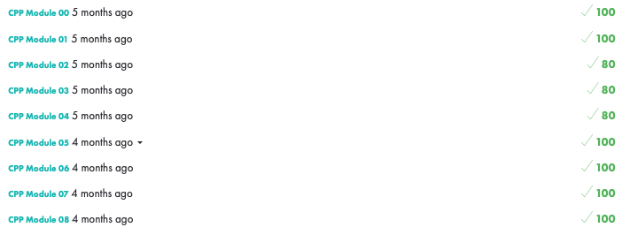

  
  <h1>CPP piscine</h1>
  
🚀 Introduction to the Object-Oriented Programming

  
<pr> 

## 👀 Preview
These modules are designed to introduce you to Object Oriented Programming. Several languages are recommended for learning OOP. Because it is derived from your good old friend C, we have chosen C++. However, being a complex language and in order not to complicate your task, you will conform to the C++98 standard.
We are aware that modern C++ is different in many aspects. If you want to improve your C++ skills, it's up to you to dig deeper after the 42 core!
You will discover new concepts as you go along. Their difficulty will increase.

## 👀 Objectives
This project brought us to work on the cpp language for the first time. We covered many topics such as subtype polymorphism, abstract classes and interfaces, iterators, algorithms, inheritance and many others. 

<!--badges : https://badge42.vercel.app-->
